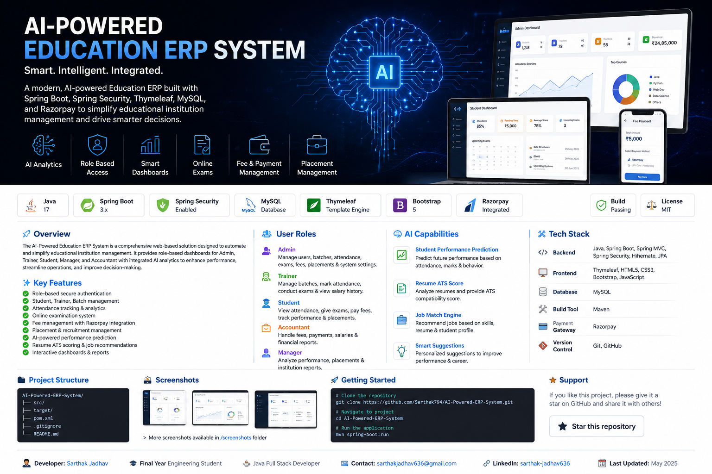
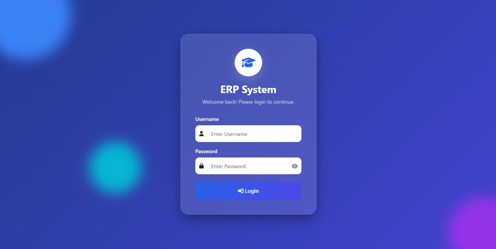

<p align="center">
  
</p>

<h1 align="center">
🎓 AI-Powered Education ERP System
</h1>

<p align="center">
A modern AI-driven Education ERP developed using Spring Boot, Spring Security, Thymeleaf, MySQL, Bootstrap and Artificial Intelligence.
</p>

<p align="center">


</p>

---

# 🌟 About the Project

The **AI-Powered Education ERP System** is a complete enterprise solution developed to simplify and digitize educational institute management.

Unlike traditional ERP systems, this platform combines **Spring Boot**, **Artificial Intelligence**, **Role-Based Access Control**, and **Modern Dashboard Analytics** into one unified application.

The system enables seamless collaboration between **Students**, **Trainers**, **Accountants**, **Managers**, and **Administrators** while automating day-to-day institutional operations.

---

# 🎯 Project Highlights

✅ AI Powered Analytics

✅ Resume ATS Scoring

✅ AI Job Recommendation

✅ Student Performance Prediction

✅ Placement Management

✅ Online Examination

✅ Attendance Management

✅ Fee Management

✅ Razorpay Integration

✅ Dashboard Analytics

✅ Spring Security Authentication

✅ Responsive UI

---

# 📑 Table of Contents

- Overview
- Key Features
- User Modules
- AI Features
- Technology Stack
- Screenshots
- Architecture
- Database Design
- Project Structure
- Installation
- Future Scope
- Developer
- License
---

# 📌 Project Overview

Managing educational institutions involves handling large volumes of student records, attendance, examinations, fee collections, placements, trainer activities, and institutional reports. Performing these tasks manually often leads to inefficiencies, errors, and delays.

The **AI-Powered Education ERP System** is a centralized web application developed to automate these operations through a secure, role-based platform. It provides dedicated dashboards for different users while integrating Artificial Intelligence to improve student performance analysis and placement readiness.

The system is designed with scalability, security, and usability in mind, making it suitable for training institutes, colleges, and educational organizations.

---

# 🎯 Objectives

The primary objectives of this project are:

- Automate institute management processes
- Reduce manual paperwork and administrative effort
- Improve communication between students and trainers
- Digitize attendance and examination workflows
- Simplify fee collection and payment tracking
- Enhance placement management
- Leverage AI for performance prediction and career guidance
- Provide real-time analytics through interactive dashboards

---

# 🚀 Key Features

<table>

<tr>
<td width="50%">

## 🎓 Student Management

- Student Registration
- Student Profile
- Qualification Details
- Specialization
- Batch Allocation
- Profile Completion
- Student Search

</td>

<td width="50%">

## 👨‍🏫 Trainer Management

- Trainer Profiles
- Assigned Batches
- Student Monitoring
- Attendance Tracking
- Salary History
- Performance Overview

</td>
</tr>

<tr>
<td>

## 📅 Attendance Management

- Daily Attendance
- Mark All Students
- Attendance Reports
- Attendance Analytics
- Monthly Tracking
- Attendance Percentage

</td>

<td>

## 📝 Examination System

- Online Exams
- Exam Creation
- Automatic Evaluation
- Exam History
- Result Analytics
- Student Scores

</td>
</tr>

<tr>
<td>

## 💰 Finance Management

- Fee Allocation
- Fee Collection
- Razorpay Integration
- Payment History
- Salary Management
- Financial Reports

</td>

<td>

## 💼 Placement Management

- Company Management
- Placement Drives
- Student Applications
- Resume Upload
- Job Tracking
- Placement Analytics

</td>
</tr>

</table>

---

# 🌟 Why This ERP?

Unlike conventional Education ERP systems, this application combines modern web technologies with Artificial Intelligence to create a smarter educational management platform.

### Key Advantages

- 🤖 AI Integrated Platform
- 🔐 Secure Role-Based Authentication
- 📊 Interactive Analytics Dashboard
- 📱 Responsive User Interface
- ⚡ Fast Performance
- 📈 Real-Time Reports
- ☁ Cloud Deployment Ready
- 💳 Online Payment Integration
- 📄 Resume Builder & ATS Analysis
- 🎯 Placement Recommendation System

---

# 👥 User Roles

The system provides dedicated dashboards and permissions for each role.

| Role | Responsibilities |
|------|------------------|
| 👨‍💼 Admin | Complete system administration and management |
| 👨‍🏫 Trainer | Student attendance, exams, batch management |
| 👨‍🎓 Student | Attendance, exams, fees, placements |
| 💰 Accountant | Fee collection, salary management, financial reports |
| 📊 Manager | Institutional analytics, placement monitoring, reports |

---

# 📈 Dashboard Analytics

The ERP provides real-time dashboards displaying:

- Student Strength
- Trainer Statistics
- Attendance Percentage
- Fee Collection Status
- Placement Statistics
- Upcoming Exams
- Recent Activities
- AI Performance Predictions
- Revenue Reports
- Institute Growth Analytics

---

# 🎖 Core Functionalities

- ✔ Secure Login
- ✔ User Management
- ✔ Student Management
- ✔ Trainer Management
- ✔ Batch Management
- ✔ Attendance Management
- ✔ Examination Management
- ✔ Fee Management
- ✔ Razorpay Integration
- ✔ Company Management
- ✔ Placement Drives
- ✔ Resume Management
- ✔ Dashboard Analytics
- ✔ AI Services
- ✔ Reports & Notifications

# 🤖 Artificial Intelligence Modules

One of the key differentiators of this ERP system is the integration of Artificial Intelligence to improve student outcomes, placement readiness, and institutional decision-making.

The AI-powered modules provide intelligent recommendations, predictive analytics, and automated insights that go beyond traditional ERP functionality.

---

## 📈 AI Student Performance Prediction

The system analyzes student academic data to identify learning patterns and predict future performance.

### Features

- Attendance Analysis
- Exam Performance Analysis
- Internal Assessment Tracking
- Subject-wise Performance
- Risk Identification
- Early Warning System
- Performance Trend Analysis
- Student Progress Monitoring

### Benefits

- Helps trainers identify weak students early
- Improves academic planning
- Enables personalized mentoring
- Supports data-driven decision making

---

## 📄 Resume ATS Score Analysis

The ERP includes an AI-powered Resume Analysis module that evaluates student resumes using ATS (Applicant Tracking System) principles.

### Features

- Resume Parsing
- ATS Score Calculation
- Keyword Analysis
- Missing Skill Detection
- Resume Quality Suggestions
- Section Validation
- Formatting Recommendations

### Benefits

- Improves placement readiness
- Increases ATS compatibility
- Helps students build professional resumes
- Provides actionable improvement suggestions

---

## 💼 AI Job Recommendation Engine

The AI Job Recommendation Engine suggests suitable job opportunities based on student profiles.

### Recommendation Parameters

- Skills
- Technologies
- Academic Performance
- Resume Quality
- Certifications
- Placement Preferences
- Specialization
- Qualification

### Output

- Recommended Companies
- Matching Job Roles
- Skill Gap Analysis
- Suggested Learning Path
- Placement Readiness Score

---

## 🎯 AI Placement Readiness Score

The ERP evaluates each student's placement readiness using multiple academic and professional parameters.

### Evaluation Criteria

- Attendance Percentage
- Academic Scores
- Resume ATS Score
- Technical Skills
- Certifications
- Projects
- Communication Skills
- Mock Test Performance

### Readiness Categories

| Score | Status |
|--------|--------|
| 90 - 100 | 🟢 Excellent |
| 75 - 89 | 🟢 Ready |
| 60 - 74 | 🟡 Needs Improvement |
| Below 60 | 🔴 High Risk |

---

## 📊 AI Dashboard Analytics

The AI Dashboard provides visual insights using intelligent data analysis.

### Dashboard Widgets

- Student Performance Trends
- Attendance Heatmaps
- Fee Collection Analytics
- Placement Statistics
- AI Performance Prediction
- Batch Performance Comparison
- Top Performing Students
- Risk Analysis Dashboard

---

# 🧠 AI Workflow

```text
              Student Data
                    │
        ┌───────────┼───────────┐
        │           │           │
   Attendance     Exams      Resume
        │           │           │
        └───────────┼───────────┘
                    │
          AI Processing Engine
                    │
      ┌─────────────┼─────────────┐
      │             │             │
 Performance     ATS Score    Job Match
 Prediction      Analysis   Recommendation
      │             │             │
      └─────────────┼─────────────┘
                    │
            Dashboard Analytics
```

---

# 💡 Intelligent Decision Support

The AI engine helps different users in different ways.

### 👨‍🎓 Students

- Resume Improvement Suggestions
- Placement Readiness
- Job Recommendations
- Performance Analysis

### 👨‍🏫 Trainers

- Identify Weak Students
- Performance Tracking
- Attendance Insights
- Batch Comparison

### 👨‍💼 Administrators

- Institutional Analytics
- Student Success Metrics
- Placement Statistics
- Revenue Analytics

### 💰 Accountants

- Payment Trends
- Revenue Reports
- Fee Collection Analysis

---

# 🚀 Why AI Matters

Traditional ERP systems primarily focus on storing and managing data.

This AI-powered ERP goes one step further by transforming institutional data into meaningful insights that help improve academic performance, placement success, and administrative efficiency.

By integrating Artificial Intelligence into everyday academic workflows, the system supports smarter decision-making, proactive student mentoring, and improved institutional outcomes.

# 🛠 Technology Stack

The AI-Powered Education ERP System is built using a modern Java Full Stack architecture, ensuring scalability, maintainability, and high performance.

---

## 💻 Backend Technologies

| Technology | Purpose |
|------------|---------|
| ☕ Java 17 | Core Programming Language |
| 🌱 Spring Boot | Backend Framework |
| 🔐 Spring Security | Authentication & Authorization |
| 🏗 Spring MVC | MVC Architecture |
| 🗄 Spring Data JPA | Database Access |
| 🔄 Hibernate ORM | Object Relational Mapping |
| 📦 Maven | Dependency Management |

---

## 🎨 Frontend Technologies

| Technology | Purpose |
|------------|---------|
| HTML5 | Page Structure |
| CSS3 | Styling |
| Bootstrap 5 | Responsive UI |
| JavaScript | Client-side Functionality |
| Thymeleaf | Server-side Rendering |

---

## 🗄 Database

| Technology | Purpose |
|------------|---------|
| MySQL | Relational Database |
| SQL | Query Language |

---

## 🤖 AI Technologies

| Feature | Purpose |
|----------|---------|
| Student Performance Prediction | Academic Analysis |
| Resume ATS Analysis | Resume Evaluation |
| Job Recommendation Engine | Placement Assistance |
| Performance Dashboard | Intelligent Analytics |

---

## 💳 Third-Party Integrations

| Integration | Purpose |
|-------------|---------|
| Razorpay | Online Fee Payments |
| Gmail SMTP | Email Notifications |
| GitHub | Version Control |

---

# 🏗 System Architecture

```text
                    ┌────────────────────────────┐
                    │        Web Browser         │
                    └─────────────┬──────────────┘
                                  │
                                  ▼
                    ┌────────────────────────────┐
                    │ HTML • CSS • Bootstrap UI │
                    │       Thymeleaf           │
                    └─────────────┬──────────────┘
                                  │
                                  ▼
                    ┌────────────────────────────┐
                    │ Spring Boot Controllers    │
                    └─────────────┬──────────────┘
                                  │
                                  ▼
                    ┌────────────────────────────┐
                    │     Service Layer          │
                    │ Business Logic & AI Engine │
                    └─────────────┬──────────────┘
                                  │
                                  ▼
                    ┌────────────────────────────┐
                    │ Spring Data JPA            │
                    │ Hibernate ORM              │
                    └─────────────┬──────────────┘
                                  │
                                  ▼
                    ┌────────────────────────────┐
                    │       MySQL Database       │
                    └────────────────────────────┘

                    External Services
                    ─────────────────
                    • Razorpay Payment Gateway
                    • Gmail SMTP
                    • AI Services
```

---

# 🏛 Layered Architecture

The application follows a clean layered architecture to improve maintainability and scalability.

```text
Presentation Layer
│
├── HTML
├── CSS
├── Bootstrap
├── JavaScript
└── Thymeleaf

        │

Controller Layer
│
├── Authentication Controller
├── Student Controller
├── Trainer Controller
├── Attendance Controller
├── Placement Controller
└── Dashboard Controller

        │

Service Layer
│
├── Student Service
├── Attendance Service
├── Exam Service
├── Placement Service
├── Fee Service
└── AI Service

        │

Repository Layer
│
├── Student Repository
├── Trainer Repository
├── Attendance Repository
├── Fee Repository
└── Placement Repository

        │

Database
│
└── MySQL
```

---

# 🔄 Application Request Flow

```text
User
 │
 ▼
Login Page
 │
 ▼
Spring Security Authentication
 │
 ▼
Role Verification
 │
 ▼
Dashboard
 │
 ▼
Controller
 │
 ▼
Business Service
 │
 ▼
Repository
 │
 ▼
MySQL Database
 │
 ▼
Response
 │
 ▼
Dashboard Updated
```

---

# 📂 Project Structure

```text
AI-Powered-ERP-System
│
├── src
│   ├── main
│   │   ├── java
│   │   │   └── com.erp
│   │   │       ├── ai
│   │   │       ├── config
│   │   │       ├── controller
│   │   │       ├── dto
│   │   │       ├── entity
│   │   │       ├── repository
│   │   │       ├── security
│   │   │       ├── service
│   │   │       └── util
│   │   │
│   │   └── resources
│   │       ├── static
│   │       ├── templates
│   │       ├── application.properties
│   │       └── application-example.properties
│   │
│   └── test
│
├── assets
│
├── screenshots
│
├── docs
│
├── README.md
│
├── pom.xml
│
└── .gitignore
```

---

# 🔐 Security Features

The ERP system incorporates enterprise-level security practices.

### Authentication

- Spring Security
- Role-Based Authentication
- Secure Login
- Session Management

### Authorization

- Admin Access Control
- Student Access Control
- Trainer Access Control
- Manager Access Control
- Accountant Access Control

### Data Protection

- Password Encryption
- Secure Session Handling
- Protected Endpoints
- Input Validation

---

# ⚡ Performance Optimizations

- Optimized SQL Queries
- Layered Architecture
- Efficient Database Relationships
- Reusable Service Components
- Modular Design
- Responsive UI
- Lightweight Thymeleaf Templates
- Clean MVC Implementation

# 📸 Application Preview

The following screenshots showcase the major modules and user interfaces of the AI-Powered Education ERP System.

---

# 🔐 Login Portal

<p align="center">

</p>

<p align="center">
<b>Secure Role-Based Authentication System</b>
</p>

---

# 👨‍💼 Admin Dashboard

<p align="center">

</p>

The Admin Dashboard provides a centralized view of the entire institution with analytics, student statistics, trainer information, fee collection, attendance reports, and placement insights.

---

# 👨‍🎓 Student Management

<p align="center">

</p>

Features

- Student Registration
- Profile Management
- Qualification Details
- Batch Allocation
- Search & Filters
- Student Analytics

---

# 👨‍🏫 Trainer Management

<p align="center">

</p>

Features

- Trainer Profiles
- Assigned Batches
- Salary Tracking
- Performance Monitoring
- Student Assignment

---

# 📋 Attendance Management

<p align="center">

</p>

Features

- Daily Attendance
- Mark All Students
- Attendance Reports
- Attendance Percentage
- Monthly Tracking

---

# 📊 Exam Analytics

<p align="center">

</p>

Features

- Exam Statistics
- Subject Performance
- Student Rankings
- Pass Percentage
- AI Insights

---

# 💼 Placement Analytics

<p align="center">

</p>

Features

- Company Dashboard
- Placement Drives
- Registered Students
- Selection Statistics
- Placement Reports

---

# 👨‍🎓 Student Dashboard

<p align="center">

</p>

Students can access attendance records, online examinations, fee status, notifications, AI-powered resume tools, and placement opportunities from a single dashboard.

---

# 📝 Online Examination

<p align="center">

</p>

Features

- Online Tests
- Instant Results
- Exam History
- Performance Reports
- AI Performance Analysis

---

# 💰 Fee Management

<p align="center">

</p>

Features

- Fee Details
- Online Payment
- Razorpay Integration
- Payment History
- Pending Fees

---

# 🤖 AI Resume Studio

<p align="center">

</p>

The Resume Studio uses AI to analyze resumes, calculate ATS scores, identify missing keywords, and provide actionable suggestions for improving placement readiness.

---

# 🎯 Highlights

✔ Responsive Dashboard

✔ AI Powered Modules

✔ Online Examination System

✔ Attendance Tracking

✔ Placement Management

✔ Razorpay Integration

✔ Interactive Analytics

✔ Modern Bootstrap UI

✔ Role-Based Authentication

✔ Enterprise-Level Dashboard

# 🎥 Demo Preview

> 🚀 A complete video demonstration of the project will be added soon.

### Planned Demo Walkthrough

- 🔐 Login
- 👨‍💼 Admin Dashboard
- 👨‍🎓 Student Module
- 👨‍🏫 Trainer Module
- 📋 Attendance
- 📝 Online Exam
- 💰 Fee Management
- 💼 Placement Module
- 🤖 AI Features
- 📊 Analytics Dashboard

# 🏗 System Design

The AI-Powered Education ERP System follows a **Layered MVC Architecture**, separating presentation, business logic, and data access layers for better maintainability and scalability.

---

## 🧩 High-Level Architecture

```text
                           Users
                              │
                              ▼
                    Web Browser (Chrome/Edge)
                              │
                              ▼
        HTML5 • CSS3 • Bootstrap • JavaScript • Thymeleaf
                              │
                              ▼
                Spring Boot MVC Controllers
                              │
                              ▼
               Service Layer (Business Logic)
                              │
          ┌─────────────┬──────────────┬──────────────┐
          │             │              │              │
          ▼             ▼              ▼              ▼
   Student Service  Exam Service  Placement Service  AI Service
          │             │              │              │
          └─────────────┴──────────────┴──────────────┘
                              │
                              ▼
              Spring Data JPA + Hibernate ORM
                              │
                              ▼
                        MySQL Database
                              │
          ┌──────────────┬──────────────┬──────────────┐
          │              │              │              │
          ▼              ▼              ▼              ▼
      Razorpay       Gmail SMTP      AI Engine      Reports
```

---

# 🧠 Core Business Modules

| Module | Description |
|---------|-------------|
| 🔐 Authentication | Secure Login & Role-Based Access |
| 👨‍🎓 Student | Student Profiles & Academic Records |
| 👨‍🏫 Trainer | Trainer & Batch Management |
| 📅 Attendance | Daily Attendance & Reports |
| 📝 Examination | Online Exams & Result Analytics |
| 💰 Finance | Fee Collection & Razorpay Integration |
| 💼 Placement | Company Drives & Applications |
| 🤖 AI Services | ATS Analysis, Prediction & Job Recommendation |
| 📊 Dashboard | Analytics & Reports |

---

# 🗄 Database Design

The ERP is built on a relational MySQL database with normalized entity relationships.

## Core Entities

```text
User
│
├── Student
├── Trainer
├── Accountant
├── Manager
└── Admin

Student
│
├── Attendance
├── Exam
├── Fee
├── Resume
├── Placement
└── Notification

Trainer
│
├── Batch
├── Attendance
└── Salary

Company
│
├── Placement Drive
└── Student Applications
```

---

# 📊 Entity Relationship Overview

```text
User
 │
 ├───────────────┐
 │               │
 ▼               ▼
Student       Trainer
 │               │
 │               ├──────── Batch
 │               │
 │               └──────── Salary
 │
 ├──────── Attendance
 │
 ├──────── Exam
 │
 ├──────── Fee
 │
 ├──────── Resume
 │
 └──────── Placement Application
                  │
                  ▼
              Placement Drive
                  │
                  ▼
               Company
```

---

# 📁 Project Structure

```text
AI-Powered-ERP-System
│
├── src
│   ├── main
│   │   ├── java
│   │   │   └── com.erp
│   │   │       ├── ai
│   │   │       ├── config
│   │   │       ├── controller
│   │   │       ├── dto
│   │   │       ├── entity
│   │   │       ├── repository
│   │   │       ├── security
│   │   │       ├── service
│   │   │       └── util
│   │   │
│   │   └── resources
│   │       ├── static
│   │       ├── templates
│   │       ├── application.properties
│   │       └── application-example.properties
│   │
│   └── test
│
├── assets
│   ├── banner.png
│   ├── architecture.png
│   ├── ai-workflow.png
│   └── er-diagram.png
│
├── screenshots
│
├── docs
│
├── README.md
│
├── pom.xml
│
└── .gitignore
```

---

# 🔄 Request Lifecycle

Every request in the ERP follows the same structured flow.

```text
User
 │
 ▼
Login
 │
 ▼
Spring Security
 │
 ▼
Authentication
 │
 ▼
Controller
 │
 ▼
Service Layer
 │
 ▼
Repository
 │
 ▼
MySQL Database
 │
 ▼
Response
 │
 ▼
Dashboard
```

---

# 🔐 Security Architecture

The application uses Spring Security to ensure secure authentication and authorization.

### Authentication

- Secure Login
- Session Management
- Role Verification
- Access Control

### Authorization

- Admin
- Student
- Trainer
- Accountant
- Manager

### Security Features

- Password Encryption
- Protected Routes
- Role-Based Permissions
- Secure Session Handling
- CSRF Protection (Spring Security)
- Input Validation

---

# ⚡ Performance Optimizations

The project incorporates several optimizations to improve scalability and responsiveness.

- Optimized SQL Queries
- Layered Architecture
- Repository Pattern
- Modular Services
- Reusable Components
- Lazy Loading where applicable
- Responsive Bootstrap UI
- Efficient MVC Design
- Clean Separation of Concerns

---

# 📈 Scalability

The architecture is designed to support future enhancements, including:

- Cloud Deployment (AWS / Azure / Render)
- Docker Containerization
- REST API Expansion
- Mobile Application Integration
- AI Chatbot
- Face Recognition Attendance
- Microservices Migration
- CI/CD Pipeline Integration

# ⚙ Installation Guide

Follow these steps to set up the AI-Powered Education ERP System on your local machine.

---

# 📋 Prerequisites

Ensure the following software is installed before running the project.

| Software | Version |
|----------|---------|
| Java | 17+ |
| Spring Tool Suite / IntelliJ | Latest |
| Maven | 3.8+ |
| MySQL | 8.0+ |
| Git | Latest |
| Chrome / Edge | Latest |

---

# 📥 Clone Repository

```bash
git clone https://github.com/Sarthak794/AI-Powered-ERP-System.git
```

Move into the project directory.

```bash
cd AI-Powered-ERP-System
```

---

# 🗄 Database Configuration

Create a new MySQL database.

```sql
CREATE DATABASE edu_erp;
```

---

# ⚙ Configure Application

Copy

```
application-example.properties
```

Rename it to

```
application.properties
```

Update the following values.

```properties
spring.datasource.url=jdbc:mysql://localhost:3306/edu_erp

spring.datasource.username=root

spring.datasource.password=your_password

razorpay.key.id=YOUR_KEY

razorpay.key.secret=YOUR_SECRET

spring.mail.username=YOUR_EMAIL

spring.mail.password=YOUR_APP_PASSWORD
```

---

# ▶ Run the Project

Using Maven

```bash
mvn spring-boot:run
```

Or

Run

```
ErpApplication.java
```

from STS / IntelliJ.

---

# 🌐 Open Application

```
http://localhost:9095
```

---

# 👤 Demo Login Credentials

> Replace these with your demo credentials before publishing.

| Role | Email | Password |
|------|--------|----------|
| Admin | admin@example.com | ******** |
| Trainer | trainer@example.com | ******** |
| Student | student@example.com | ******** |
| Accountant | accountant@example.com | ******** |
| Manager | manager@example.com | ******** |

---

# 💳 Payment Integration

The ERP supports secure online fee payment using Razorpay.

Features

- Online Fee Collection

- Payment History

- Secure Transactions

- Payment Status Tracking

---

# 📧 Email Integration

The application supports automated email services.

Used for

- Notifications

- Password Reset

- Placement Updates

- Student Communication

- Payment Confirmation

---

# 📂 Folder Structure

```
AI-Powered-ERP-System

│

├── src

├── assets

├── screenshots

├── docs

├── pom.xml

├── README.md

└── .gitignore
```

---

# 🚀 Deployment Options

The application can be deployed on:

✅ AWS EC2

✅ Render

✅ Railway

✅ Azure App Service

✅ Docker

✅ VPS

---

# 🐳 Docker (Future)

```bash
docker build -t ai-powered-erp .

docker run -p 9095:9095 ai-powered-erp
```

---

# 📈 Production Checklist

Before deployment ensure

- Database credentials configured

- SMTP configured

- Razorpay keys updated

- AI services configured

- Logs disabled

- Debug mode disabled

- Strong passwords

- HTTPS enabled

---

# 🔒 Security Checklist

✔ Spring Security

✔ Role-Based Authentication

✔ Session Management

✔ Password Encryption

✔ Protected Routes

✔ Secure Login

✔ Input Validation

✔ CSRF Protection

---

# 🧪 Testing

Recommended Testing

- Login Testing

- Attendance Testing

- Examination Testing

- Fee Payment Testing

- Placement Module

- AI Module

- Dashboard Analytics

---

# 📚 API Endpoints

Example

```
/login

/admin/dashboard

/student/dashboard

/trainer/dashboard

/api/attendance

/api/exams

/api/placements
```

---

# 📈 Project Statistics

| Metric | Value |
|---------|-------|
| Architecture | MVC |
| Backend | Spring Boot |
| Frontend | Thymeleaf |
| Database | MySQL |
| Authentication | Spring Security |
| Payment Gateway | Razorpay |
| AI Modules | 4+ |
| User Roles | 5 |
| Major Modules | 15+ |

---

# 💡 Best Practices Used

- Layered Architecture

- Repository Pattern

- DTO Pattern

- Dependency Injection

- MVC Design Pattern

- Clean Code Principles

- Modular Development

- Responsive UI

- Reusable Components

- Service-Oriented Design

# 🌟 Why This Project Stands Out

Most Education ERP systems focus on digitizing academic operations. This project goes a step further by integrating **Artificial Intelligence**, **interactive analytics**, **placement readiness**, and **modern dashboard visualization** into a single platform.

The goal is not only to manage educational data, but also to generate meaningful insights that improve student success and institutional efficiency.

---

# 🚀 Traditional ERP vs AI-Powered ERP

| Traditional ERP | AI-Powered Education ERP |
|-----------------|--------------------------|
| Student Records | Intelligent Student Analytics |
| Manual Attendance | Attendance Analytics Dashboard |
| Basic Reports | Interactive Dashboard Reports |
| Manual Resume Review | AI Resume ATS Analysis |
| Static Placement Data | AI Job Recommendation Engine |
| Manual Performance Tracking | AI Performance Prediction |
| Offline Fee Collection | Razorpay Online Payments |
| Simple User Roles | Secure Role-Based Authentication |
| Basic Dashboards | Real-Time Analytics Dashboards |
| Limited Insights | AI-Powered Decision Support |

---

# 💡 What Makes This Project Unique?

### 🤖 Artificial Intelligence

Unlike traditional ERP systems, this platform integrates AI into multiple modules.

- Student Performance Prediction
- Resume ATS Analysis
- Job Recommendation Engine
- Placement Readiness Analysis
- Intelligent Dashboard Insights

---

### 📊 Real-Time Analytics

The ERP provides comprehensive dashboards that display institutional data in an interactive and meaningful way.

Dashboard includes:

- Student Statistics
- Attendance Reports
- Examination Analytics
- Fee Collection Overview
- Placement Statistics
- Revenue Insights
- Batch Performance
- AI Predictions

---

### 🔐 Enterprise-Level Security

Security is implemented using Spring Security with proper role-based authorization.

Roles include:

- 👨‍💼 Admin
- 👨‍🏫 Trainer
- 👨‍🎓 Student
- 💰 Accountant
- 📊 Manager

Each user has access only to the modules assigned to their role.

---

### 💼 Placement Ecosystem

The ERP provides a complete placement management solution.

Features include:

- Company Registration
- Placement Drives
- Student Applications
- Resume Management
- AI Resume Review
- Placement Analytics
- Job Recommendations

---

### 📈 Academic Intelligence

The platform continuously analyzes academic data to help trainers and administrators make informed decisions.

Insights include:

- Weak Student Identification
- Attendance Trends
- Exam Performance
- Batch Comparison
- Student Progress
- Performance Forecasting

---

### 💳 Digital Fee Management

Integrated Razorpay payment gateway enables secure online fee collection.

Features:

- Online Payment
- Payment History
- Fee Tracking
- Pending Fee Reports
- Transaction Records

---

### 🎯 Modern User Experience

The application provides an intuitive interface built using Bootstrap and Thymeleaf.

Benefits:

- Responsive Design
- Clean Dashboard
- Easy Navigation
- Mobile Friendly Layout
- Interactive Components

---

# 🏆 Key Achievements

✔ AI Integrated Education ERP

✔ Full Stack Java Application

✔ Secure Role-Based Authentication

✔ Modern Dashboard Analytics

✔ Online Examination System

✔ Attendance Automation

✔ Placement Management

✔ AI Resume Analysis

✔ Razorpay Integration

✔ Scalable MVC Architecture

✔ Enterprise-Level Design

✔ Responsive UI

---

# 📊 Project Metrics

| Metric | Details |
|---------|----------|
| Development Architecture | MVC |
| Programming Language | Java 17 |
| Backend Framework | Spring Boot |
| Security Framework | Spring Security |
| ORM | Hibernate |
| Database | MySQL |
| Frontend | Thymeleaf + Bootstrap |
| Build Tool | Maven |
| Payment Gateway | Razorpay |
| User Roles | 5 |
| Major Functional Modules | 15+ |
| AI Modules | 4+ |
| Dashboard Pages | 20+ |
| Database Tables | 25+ |
| Screens Implemented | 35+ |

---

# 🎯 Learning Outcomes

Developing this ERP strengthened practical knowledge in:

- Full Stack Java Development
- Spring Boot Framework
- Spring Security
- MVC Architecture
- Hibernate & JPA
- Database Design
- REST Principles
- Authentication & Authorization
- Payment Gateway Integration
- AI-Assisted Features
- Dashboard Development
- Software Architecture
- Git & GitHub
- Software Documentation

---

# 🚀 Future Vision

The project is designed to evolve into a complete enterprise platform.

Planned improvements include:

- AI Chatbot Assistant
- Mobile Application
- Face Recognition Attendance
- REST API Documentation
- Docker Containerization
- Cloud Deployment
- Microservices Migration
- AI-Based Career Guidance
- Email & SMS Automation
- Learning Management System Integration

---

# ❤️ Project Vision

The vision behind this project is to build an intelligent educational platform that not only manages institutional operations but also empowers students, trainers, and administrators through Artificial Intelligence, automation, and data-driven decision making.

The long-term goal is to transform traditional educational management into a smarter, faster, and more efficient digital ecosystem.

# 🛣️ Project Roadmap

The project will continue evolving with additional enterprise-level capabilities.

## ✅ Completed

- Role-Based Authentication
- Student Management
- Trainer Management
- Batch Management
- Attendance Management
- Examination System
- Exam Analytics
- Fee Management
- Razorpay Integration
- Placement Management
- Dashboard Analytics
- AI Student Performance Prediction
- AI Resume ATS Analysis
- AI Job Recommendation Engine

---

## 🚧 In Progress

- AI Chat Assistant
- Advanced Placement Analytics
- Resume Builder Improvements
- Dashboard Optimization
- Performance Enhancements

---

## 🚀 Planned Features

- 📱 Android Application
- 🍎 iOS Application
- ☁ Cloud Deployment
- 🐳 Docker Support
- ⚙ CI/CD Pipeline
- 📚 REST API Documentation
- 🤖 Generative AI Assistant
- 📹 Video Learning Module
- 🎥 Online Live Classes
- 📊 Power BI Integration
- ☁ AWS Deployment
- 📈 Predictive Analytics Dashboard

---

# 🌍 Live Demo

The application is currently running in the local development environment.

Future deployment targets include:

- AWS EC2
- Render
- Railway
- Azure App Service
- Docker

> 🔗 Live Demo Link: **Coming Soon**

---

# 📽 Project Demonstration

A complete walkthrough video will be added covering:

- Secure Login
- Admin Dashboard
- Student Module
- Trainer Module
- Attendance Management
- Online Examination
- Fee Payment
- Placement Module
- AI Features
- Analytics Dashboard

> 🎬 Demo Video: **Coming Soon**

---

# 📚 Documentation

The repository includes detailed documentation covering:

- Installation Guide
- System Architecture
- Database Design
- AI Modules
- Project Structure
- Deployment Guide

Additional documentation will be available in the **docs/** directory.

---

# 🤝 Contributing

Contributions are welcome!

If you would like to improve the project:

1. Fork the repository
2. Create a new feature branch

```bash
git checkout -b feature/new-feature
```

3. Commit your changes

```bash
git commit -m "Add new feature"
```

4. Push to GitHub

```bash
git push origin feature/new-feature
```

5. Open a Pull Request

---

# 🐞 Report Issues

Found a bug?

Please create an Issue with:

- Description
- Steps to Reproduce
- Expected Result
- Screenshots (if applicable)

---

# 📜 License

This project is licensed under the **MIT License**.

Feel free to use this project for learning and educational purposes.

---

# 👨‍💻 Developer

## Sarthak Jadhav

**Final Year B.E. Electronics & Telecommunication Engineering**

### Java Full Stack Developer

### Technical Skills

#### Programming Languages

- Java
- JavaScript
- SQL

#### Backend

- Spring Boot
- Spring MVC
- Spring Security
- Hibernate
- Spring Data JPA

#### Frontend

- HTML5
- CSS3
- Bootstrap
- Thymeleaf
- JavaScript

#### Database

- MySQL
- PostgreSQL

#### Tools

- Git
- GitHub
- Maven
- STS
- IntelliJ IDEA
- Postman

---

# 📬 Connect

### GitHub

https://github.com/Sarthak794

### LinkedIn

https://www.linkedin.com/in/sarthakjadhav

---

# 🙏 Acknowledgements

Special thanks to:

- Spring Boot Team
- Thymeleaf Team
- Hibernate ORM
- Bootstrap Team
- Razorpay
- MySQL
- GitHub
- Open Source Community

---

# ⭐ Show Your Support

If you found this project useful,

⭐ Star the repository

🍴 Fork the project

🛠 Contribute to improve it

📢 Share it with others

---

# ❤️ Thank You

Thank you for visiting this repository.

If you have suggestions, feedback, or ideas for improvement, feel free to open an Issue or connect with me.

Happy Coding! 🚀

---

<p align="center">

### ⭐ If you like this project, don't forget to Star the Repository ⭐

Made with ❤️ using Java, Spring Boot, Thymeleaf, MySQL & Artificial Intelligence

</p>

